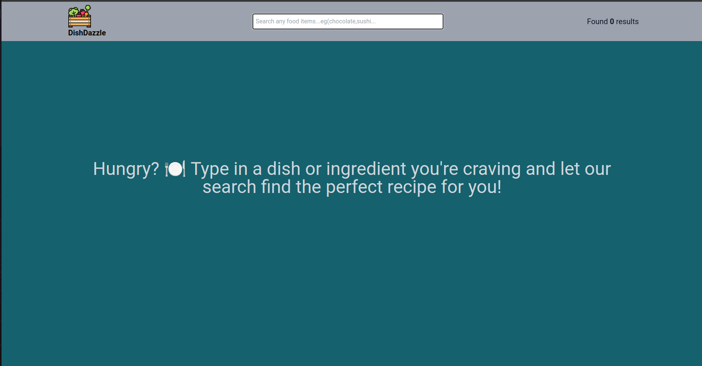
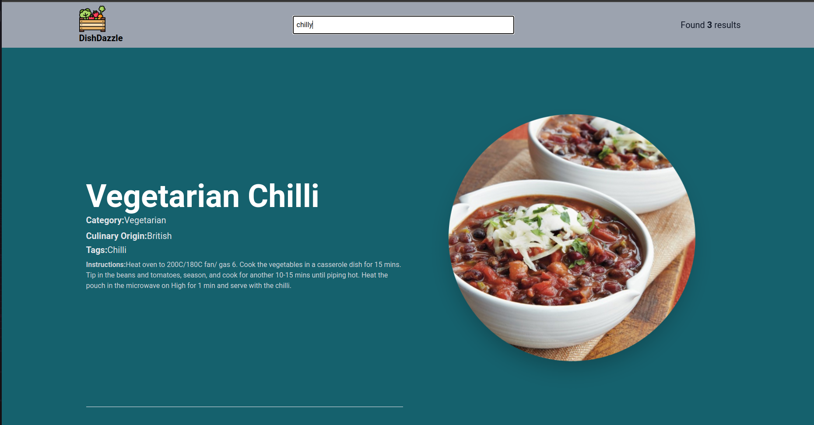

## DishDazzle
DishDizzle is a delightful recipe searching web app built using React and powered by TheMealDB API. Whether you're a seasoned chef or a kitchen novice, DishDizzle is your go-to platform for discovering and exploring a vast array of recipes to satisfy your culinary cravings.

## Features:
- **Recipe Search:** Easily search for recipes by name or ingredients. DishDizzle provides a user-friendly interface to find the perfect dish for any occasion.

- **Recipe Details:** Get comprehensive details about each recipe, including ingredients, instructions, and a high-quality image to give you a visual preview of the mouth-watering dish.

- **Responsive Design:** DishDizzle is designed to be responsive, ensuring a seamless experience across various devices, from desktops to tablets and smartphones.

## Tech Stack
DishDizzle is built using the following technologies:
- **React** 
- **TailwindCSS**
- **TheMealDB API**

## Screenshots

**_Happy cooking with DishDizzle! 🍽️✨_**
